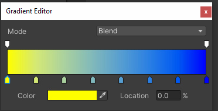

# Gradient Color Space

A tool to convert a simple Unity.Gradient into a peicewise gradient interpolated in another color space.
Useful to create nice looking gradients and avoid 'muddy' or perceptionally incorrect interpolated colors.

## Installation

Installation via the Unity Package Manager.

### OpenUPM

1. In Unity on the top toolbar, go to `Edit > Project Settings > Package Manager`.
2. Add a new Scoped Registry (or edit the existing OpenUPM entry)
```txt
Name        package.openupm.com
URL         https://package.openupm.com
Scope(s)    com.popupasylum.gradientcolorspace
```
3. Click Save (or Apply)
4. Open `Window > Package Manager`
5. Next to the `+` icon, select `My Registries`
6. Select `Gradient Color Space` and click install on the bottom right.

### Git

1. In Unity on the top toolbar, go to `Window > Package Manager`.
2. Click the `+` icon and select `Add package from Git URL`.
3. Enter the Git URL of this repository `https://github.com/markeahogan/GradientColorSpace.git`.

## Gradient Conversion

A Gradient with 2 keys can be converted into a piecewise gradient with the appearance of another color space using the `GradientColorSpace.ConvertGradient` method. It creates 6 keys between the first and last keys that are interpolate from the first to last color using the chosen color space.

##### Original Gradient

##### Oklab Conversion

##### SRLAB2 Conversion


## Context Menu

Right-clicking a gradient properties label will show a 'Color Space' context menu, allowing quick conversion.


